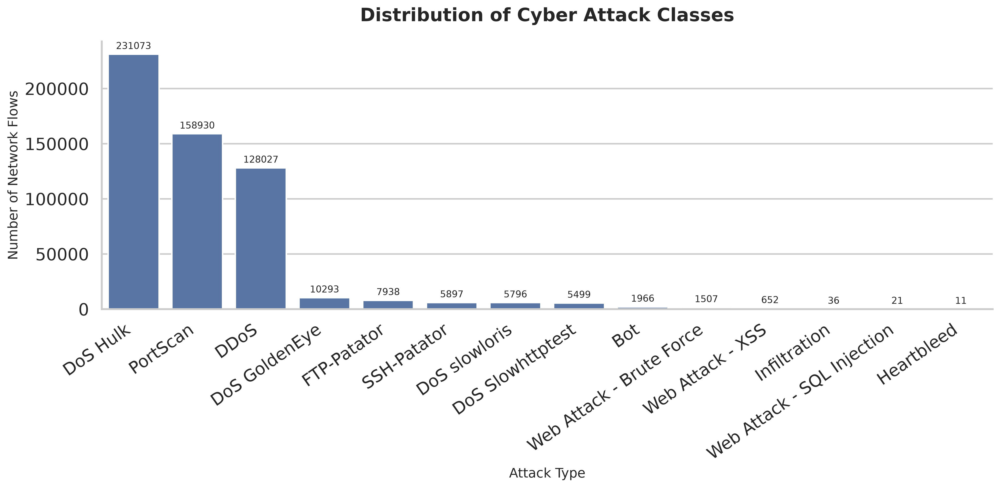
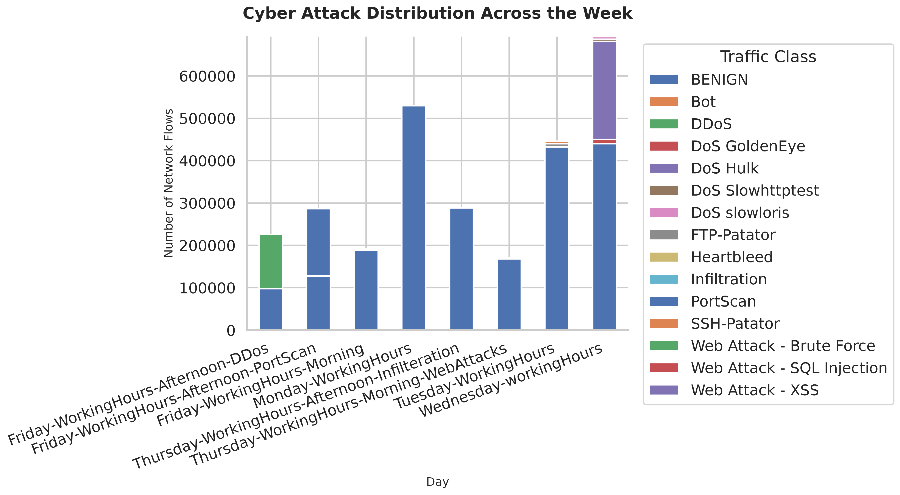
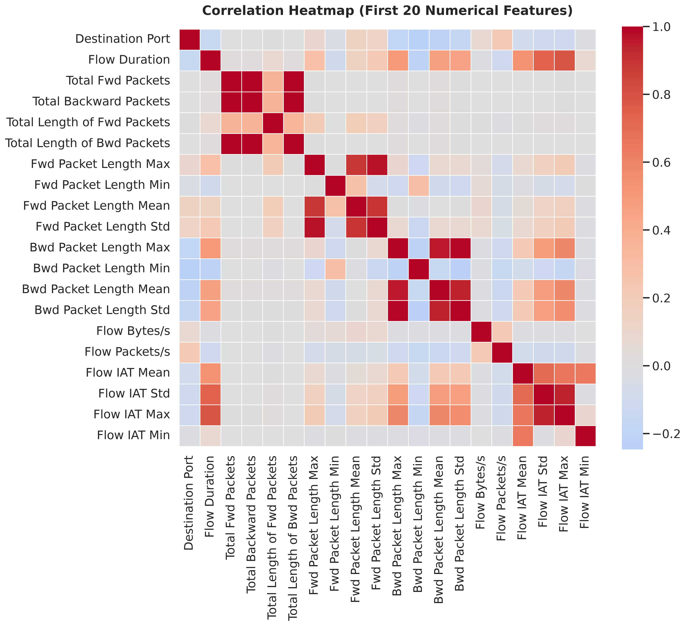
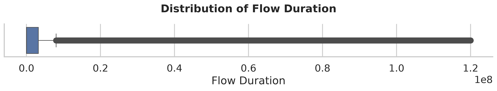
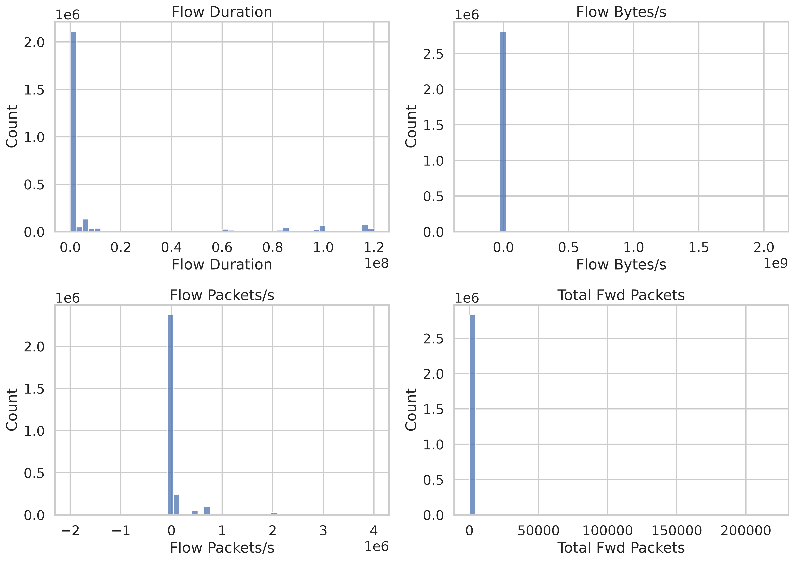

# Exploratory Data Analysis (EDA)

## Overview

The objective of this exploratory data analysis is to understand the characteristics of the CICIDS2017 dataset before developing machine learning models.

The analysis focuses on:

- Attack class distribution
- Temporal evolution of attacks
- Feature relationships
- Feature distributions
- Potential outliers
- Machine learning implications

---

# 1. Attack Class Distribution

### Key Observations

- BENIGN traffic dominates the dataset.
- Among attack classes, DoS Hulk is the most common.
- Heartbleed is extremely rare (11 samples).
- The dataset exhibits severe class imbalance.

### ML Implications

Accuracy alone will not be an appropriate evaluation metric.

Future model evaluation should emphasize:

- Precision
- Recall
- F1-score
- Confusion Matrix

---

# 2. Attack Distribution Across the Week

### Key Observations

- Monday contains only benign traffic.
- Tuesday introduces authentication attacks.
- Wednesday is dominated by denial-of-service attacks.
- Thursday focuses on web application attacks.
- Friday contains large-scale network attacks such as DDoS and PortScan.

### ML Implications

The dataset preserves a realistic temporal progression of attack scenarios, making it useful for understanding how different attack families evolve over time.

---

# 3. Feature Correlation

### Key Observations

- Several network features exhibit strong positive correlations.
- Some groups of features likely contain overlapping information.
- Most features remain only weakly correlated.

### ML Implications

Highly correlated features may be redundant for some algorithms, although tree-based models generally handle feature correlation well.

---

# 4. Flow Duration Distribution

### Key Observations

- Flow Duration contains numerous extreme outliers.
- The distribution is highly skewed.
- Most network flows are relatively short.

### ML Implications

Future preprocessing may include robust scaling or logarithmic transformations for certain algorithms.

---

# 5. Feature Distributions

### Key Observations

- Most numerical features exhibit heavy right skew.
- Several features span multiple orders of magnitude.
- Long-tailed distributions are common.

### ML Implications

Tree-based models are expected to perform well on these distributions, while linear models may require additional preprocessing.

---

# Overall Findings

The exploratory analysis indicates that:

- The dataset is heavily imbalanced.
- Attack types occur in clearly separated temporal phases.
- Numerical features are highly skewed.
- Multiple outliers are naturally present within network traffic.
- Feature correlation exists but is not universally strong.

The dataset is now well understood and ready for feature engineering and machine learning model development.

---

# Limitations

The exploratory analysis also highlights several limitations of the dataset:

- The dataset is highly imbalanced, with benign traffic dominating overall.
- Some attack categories (e.g., Heartbleed) contain very few samples, making them challenging for machine learning models.
- Many numerical features exhibit heavy right-skew and extreme outliers.
- The dataset represents a controlled experimental environment rather than continuous real-world enterprise traffic.

These limitations will influence feature engineering, model evaluation, and interpretation in the next phase.